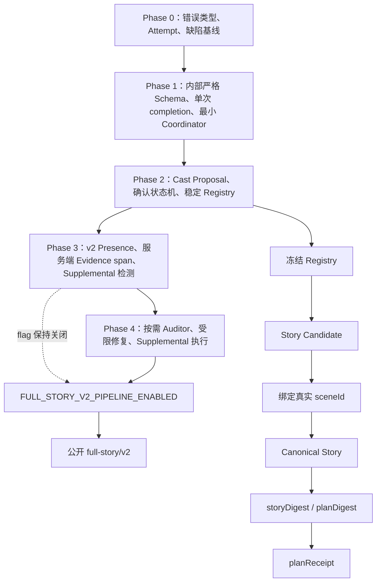

# Full Story Scene Contract 最终实施计划（修订版）

- 计划日期：2026-07-30
- 依据：`docs/Full-Story-Scene-Contract-系统缺陷审计-2026-07-30.md`
- 基线 HEAD：`a178c230edb01657f67d44e11174df6da37de2b0`
- 最低运行时：Node `>=24 <25`
- 实施规则：逐 Phase 实施、测试、提交和汇报；没有明确批准不得进入下一 Phase

## 1. 最终架构决策

1. Phase 1 只使用内部 `legacy-full-story-strict` schema，不发布 `full-story/v1`；最终公开 API 直接切换为 `full-story/v2`。
2. `Character Registry`、结构化 `presences` 和结构化 speaker 是权威角色事实源；deprecated projection 只用于展示。
3. Full Story 生成使用两阶段角色流程：

```text
Cast Proposal
→ 服务端验证/必要时等待确认
→ 签发冻结 Registry
→ 使用 Registry 生成 Full Story
→ 将临时角色绑定到实际 sceneId
```

4. Cast Proposal 不得引用尚不存在的 `/sceneScript/*`，使用 `scopePolicy`、`maxSceneCount` 和非权威 `sceneHint`。
5. Model draft 的 Evidence 只输出 `sourcePath`、`quote` 和可选 `occurrenceIndex`；UTF-16 span 由服务端计算。
6. 未知角色通过 Supplemental Cast Proposal 扩展 Registry；candidate 不得自行签发 `characterId`。
7. Evidence Auditor 按需调用，只输出 diagnostics，不能签发 production-ready，模型 confidence 不构成 Contract 结论。
8. Phase 3 与 Phase 4 共用 `FULL_STORY_V2_PIPELINE_ENABLED`，可以分 commit，但必须在同一发布窗口启用。
9. Cast confirmation operation 只保存在单进程内；重启后返回 `409 OPERATION_EXPIRED`。Receipt 可通过无模型 revalidation 换发。
10. 整个 Full Story operation 最多 6 次 provider call，包含 Cast、Story、Auditor、patch、局部重生成、复核和 Candidate 2。

### Provider 调用数

| 路径 | 新建 Registry | 复用 Registry |
| --- | ---: | ---: |
| 普通无歧义 Story | 2：Cast + Story | 1：Story |
| 初始 Cast 等待确认 | 确认前 1；确认后再 1 | 不适用 |
| 仅 Auditor 复核 | 3 | 2 |
| 确定性 Supplemental 自动批准并局部重生成 | 3 | 2 |
| Auditor → 修复/局部重生成 → 复核 | 5 | 4 |
| 整体不可修复而生成 Candidate 2 | 3；如需 Auditor 为 4 | 2；如需 Auditor 为 3 |

## 2. 修复依赖图



## 3. 分阶段实施

### Phase 0：测试和可观测基线

范围：

- 新增 `ModelPipelineError`、`ValidationDiagnostic` 和 `AttemptRecord`。
- 新增有界 TTL Attempt/raw output store。
- raw output 默认 TTL 30 分钟；单条最多 256KB；进程总量最多 50MB。
- 超限时先清理过期条目，再按创建顺序淘汰最旧条目。
- API 和普通日志不返回 raw output，只返回 `rawOutputRef` 与脱敏 attempt metadata。
- server 使用统一错误序列化，保留兼容的 `error:string`。
- 固化 FS、RC、DS characterization fixtures。
- 不改变 Full Story、Scene Contract、retry、provider 调用或成功/失败判定。

验收：

```bash
node --test \
  test/model-errors.test.js \
  test/attempt-store.test.js \
  test/full-story-defect-characterization.test.js

npm test
git diff --check
```

完整测试必须使用 Node 24。Phase 0 完成并汇报后停止。

### Phase 1：严格门禁和最小 Coordinator

- 新增内部 `legacy-full-story-strict` exact schema，递归拒绝缺字段、`null`、错误类型和 unknown fields。
- 内部 schema 名称不写入公开响应，不形成公开 v1。
- MiMo/Qwen 拆出单次 `requestCompletion`，读取 HTTP、envelope、content、request ID、usage 和 `finish_reason`。
- `finish_reason=length` 在 JSON parse 前归类为 truncation。
- Full Story strict parser 只接受 trim 后恰好一个 JSON object，不删除字符串内 `<think>`，不截取子对象。
- 提前建立最小 `ModelCallCoordinator`，统一预算、attempt、错误分类和 retry policy。
- provider client 内部 Full Story retry 固定为 0；Phase 4 扩展同一个 Coordinator，不另建 retry 体系。
- Animation 入口复用同一 Full Story validator；失败时下游 provider 调用数为 0。

### Phase 2：Cast Proposal、Registry 和确认状态机

Cast Proposal 临时角色条目：

```json
{
  "proposalRef": "cast-proposal-1",
  "entityClass": "single-scene-functional",
  "proposedDisplayName": "快递员",
  "scopePolicy": "scene-limited",
  "maxSceneCount": 1,
  "sceneHint": "送包裹的短暂场面"
}
```

规则：

- `scopePolicy` 只允许 `story-wide` 或 `scene-limited`。
- `story-wide` 的 `maxSceneCount` 为 `null`；`scene-limited` 为正整数。
- `sceneHint` 不得解释为 sceneId、JSON Pointer 或授权范围。
- Schema 拒绝 `sceneScope`、`boundSceneIds` 和 `/sceneScript/*`。
- Story 完成后根据 canonical presence/speaker 绑定实际 sceneId；超过 `maxSceneCount` 时拒绝。

自动批准：

- `anonymous-extra`
- `anonymous-group`
- `crowd`
- 无正式名字、仅一场、无剧情转折、无长期关系、无跨场连续性、无独立参考资产的功能角色
- 单场功能角色最多一条不超过 80 Unicode code points 的功能性台词

具名、多场、多行对白、特写、人物弧、关键剧情、长期关系或独立参考资产必须确认；不得静默降级为匿名实体。

Character ID 来源：

```text
固定系统角色槽位
→ 上游 declarationId
→ 稳定 source identifier
→ 服务端随机生成并持久绑定
```

helper 数组索引不得进入 ID。重排通过 declaration/source identifier 恢复绑定；删除不回收 ID；插入只创建新 ID。

确认 API：

- 初始或 Supplemental 确认返回 HTTP 202：`status`、`operationId`、`proposalToken`、`storyContextDigest`、`castProposal`、`expiresAt`。
- `POST /api/full-story/cast-confirmations` 接收 `approve`、`reject` 或 `modify`。
- token 默认 30 分钟、单次消费，绑定 operation、proposal digest、context digest、environment 和 audience。
- 仅 token 过期、上下文变化、重复使用、签名不匹配或进程状态丢失返回 409。
- 进程重启后统一返回 `409 OPERATION_EXPIRED`。

### Phase 3：Presence、Evidence canonicalization 和 Supplemental 检测

- 引入 `full-story/v2` model-draft 和 canonical schema。
- draft 可包含 Registry ref 或无授权的 `unregistered` local ref；canonical Story 只允许服务端签发的 `characterId`。
- presence 支持 `live-visible`、`live-partial`、`live-indirect`、`depicted`、`audio`、`mentioned`。
- speaker 使用结构化 character/narrator/voice-over union。
- deprecated `characters` 只从 live presence 派生，不参与 digest 或权威判断。
- 确定性检查 Schema、ID、scope、speaker/presence、derived projection 和 Evidence pointer。
- 本阶段不调用 Auditor；可以产生内部 `auditRequired`，但公开 v2 flag 必须关闭。
- Phase 3 独立部署不得向用户暴露无处理器的 `AUDIT_REQUIRED`。

### Phase 4：按需 Auditor、Supplemental 执行和受限修复

Auditor 触发条件：

- 名称/alias 与 presence 不一致
- 未知具名人物嫌疑
- 文本与 speaker/presence 明显冲突
- live/depicted/audio 分类歧义
- patch 或局部重生成后的定向复核

Auditor 只返回 diagnostics；schema 拒绝 `productionReady`、授权字段和 Contract `confidence`。

失败处理：

- 仅软性嫌疑且确定性校验通过时，Auditor 服务失败只生成 warning，不阻断。
- 确定性错误仍存在时，按原错误 repair/fail，不能借 Auditor 失败放行。
- repair 后确定性校验通过而复核失败时，可带 warning 接受。

Phase 3、4 完整合并后，在同一发布窗口启用 `FULL_STORY_V2_PIPELINE_ENABLED`。

## 4. Character Registry 与 Supplemental Cast Proposal

Full Story draft 中的未知角色只能表示为：

```json
{
  "kind": "unregistered",
  "localRef": "unknown-1",
  "label": "快递员",
  "proposedEntityClass": "single-scene-functional"
}
```

它不是合法 `characterId`，不能进入 canonical Story。

服务端流程：

1. 聚合 local ref 的 presence、speaker 和文本路径。
2. 构造 Supplemental Cast Proposal。
3. 按自动批准政策分类。
4. 自动批准时签发新 ID 和 Registry revision。
5. 只局部重生成受影响的 `/sceneScript/{index}`。
6. 原子合并并执行完整 Story、Registry、Presence 和 Evidence 校验。
7. 必须确认时返回 HTTP 202，保留 candidate 和受影响路径。
8. 用户确认后更新 Registry，再局部重生成。
9. 每个 operation 最多一次 Registry expansion；绑定已有角色的 sceneId 不计 expansion。
10. expansion 后再次出现未知角色时返回 `REGISTRY_EXPANSION_LIMIT`，不得二次扩展或默认整篇重生。

匿名实体获得 scene-limited ephemeral `characterId`，随 Registry/Story package 保存，但不进入 Character Feature Compiler 或角色参考图流程。

## 5. Presence 和 Evidence

Model draft：

```json
{
  "sourcePath": "/sceneScript/0/visibleAction",
  "quote": "铃木奶奶站在柜台后",
  "occurrenceIndex": 0
}
```

模型输出 `start`、`end` 或 `offsetUnit` 时按 unknown field 拒绝。

服务端：

1. 解析 JSON Pointer，确认它指向允许的原始字符串叶子。
2. 在未做 Unicode 归一化的原始 JS 字符串中查找 `quote`。
3. `occurrenceIndex` 从 0 开始，匹配扫描包含重叠位置。
4. 唯一匹配时可省略；多处匹配而省略时拒绝。
5. 使用 JS UTF-16 code-unit index 计算 `start` 和排他性 `end`。
6. 校验 `source.slice(start, end) === quote`。
7. 写入 canonical Story：

```json
{
  "sourcePath": "/sceneScript/0/visibleAction",
  "quote": "铃木奶奶站在柜台后",
  "occurrenceIndex": 0,
  "start": 0,
  "end": 11,
  "offsetUnit": "utf16-code-unit"
}
```

diagnostics：

- `EVIDENCE_SOURCE_PATH_INVALID`
- `EVIDENCE_QUOTE_EMPTY`
- `EVIDENCE_QUOTE_NOT_FOUND`
- `EVIDENCE_QUOTE_AMBIGUOUS`
- `EVIDENCE_OCCURRENCE_OUT_OF_RANGE`
- `EVIDENCE_SPAN_MISMATCH`

NFKC、空白和大小写归一化只在 exact span 校验后用于 alias lookup，不得在归一化文本上计算偏移。源字符串修改后必须重新 canonicalize Evidence。

## 6. Retry/Repair 执行链

```text
primary completion
→ envelope / finish reason / strict JSON
→ deterministic schema、Registry、scope、speaker/presence、Evidence
→ 必要时 Supplemental Proposal
→ 必要时 Auditor
→ 受限 JSON patch
→ 或指定 scene/path 的局部重生成
→ 服务端原子合并
→ 完整确定性复验
→ 必要时定向 Auditor 复核
```

- patch 只能修改 diagnostics 明确授权的 JSON Pointer。
- 局部重生成返回 `{path, value}` 或完整 scene subtree，不返回整篇 Story。
- 合并在 clone 上原子完成，失败不改变原 candidate。
- 不要求模型重写未受影响文案；未授权路径由服务端保留。
- 整体重生成只用于候选整体不可修复，结果作为 Candidate 2，不算 repair attempt。
- Candidate 2 使用当前冻结/已扩展 Registry，不重新运行 Cast Proposal。
- Candidate 2 不要求与 Candidate 1 无关文案逐字相同，但必须完整复验。
- client 内部 retry 为 0；所有调用由 Coordinator 记账，总上限 6。

## 7. Digest 与 Receipt

`storyDigest` 只包含 canonical Story 权威字段，包括 Registry ID、Presence、speaker 和 Evidence 的 `sourcePath/quote/occurrenceIndex`。

排除：

- deprecated `characters`
- UI/display-only 字段
- receipt、attempt、diagnostics、runtime metadata
- 可重新派生的 `start/end/offsetUnit`
- 其他可重新派生 projection

`planDigest` 只包含权威 Animation Plan 字段，排除 receipt、compiler/runtime metadata、UI 字段、媒体结果和可重新编译的展示/prompt alias。

Receipt：

```json
{
  "schemaVersion": "plan-receipt/v1",
  "receiptId": "rcpt_...",
  "keyId": "key-2026-07",
  "environment": "production",
  "audience": "mimo-media-production",
  "variantId": "V1",
  "registryVersion": "sha256:...",
  "sourceStoryDigest": "sha256:...",
  "planDigest": "sha256:...",
  "shotDigests": {},
  "characterDigests": {},
  "issuedAt": "...",
  "expiresAt": "...",
  "signature": "hmac-sha256:..."
}
```

- 默认有效期 7 天。
- 剩余不足 24 小时时允许无模型 refresh。
- refresh 重新验证 package、Schema、Registry 和所有 authority digests。
- Story、Plan、Registry、refine 或权威 digest 改变后旧 Receipt 失效。
- 过期 Plan 只读；revalidation 成功后换发新 Receipt。
- key 轮换：加入新 key → 切 active key → refresh → 旧 key 保留最长 Receipt TTL 加 1 天 → 删除。
- `environment`、`audience` 必须精确匹配。
- 进程重启后，只要持久 key 与完整 package 存在，即可无模型 revalidation 换发；cast operation 不可恢复。

## 8. 受影响缺陷覆盖矩阵

| 缺陷 | 修复 |
| --- | --- |
| FS-01、FS-02 | Presence、结构化 speaker、可定位 Evidence；Auditor 仅按需 |
| FS-03 | 初始及 Supplemental Cast Proposal；未知角色不能自签 ID |
| FS-04 | 服务端 Registry 和稳定 ID |
| FS-05、FS-06 | Registry alias index，不再以字符串包含判断身份 |
| FS-07 | `characters` 从 live presence 派生 |
| FS-08 | Phase 1 内部递归 strict schema |
| FS-09 | Registry 数量限制和预编译索引 |
| RC-01～RC-05 | completion envelope、finish reason、strict parser、统一 Coordinator |
| RC-06 | Schema、Registry、Presence、Evidence 聚合 diagnostics |
| RC-07 | 受限 patch、局部重生成、原子合并 |
| RC-08 | operation provider budget=6，禁止嵌套 retry |
| RC-09 | Phase 0 Attempt Store 和统一错误序列化 |
| DS-01、DS-02、DS-07、DS-08 | 保留既定导入、媒体、refine 和事务门禁 |
| DS-04、DS-05 | canonical digest、Registry revision 和失效链 |
| DS-10 | 保留 compiler in-flight coalescing 计划 |
| DS-11 | 按 client/model/operation origin 映射 400、409、502 |

## 9. 提交拆分

1. `docs(contract): incorporate cast scope and evidence canonicalization`
2. `test(observability): baseline full-story defects and model attempts`
3. `feat(contract): add internal strict full-story validation`
4. `refactor(model): add completion envelopes and coordinator kernel`
5. `feat(cast): add proposal policy and stable character registry`
6. `feat(cast): add confirmation and supplemental expansion operations`
7. `feat(story): add v2 presence and server-computed evidence spans`
8. `refactor(animation): consume registry character ids`
9. `feat(recovery): add on-demand evidence auditor`
10. `feat(recovery): add restricted patch and local scene regeneration`
11. `feat(provenance): add canonical digests and renewable receipts`
12. 保留既定 import、media、UI transaction 和 artifact isolation commits。

每个 Phase 完成后必须汇报 commit SHA、实际文件、行为变化、未变化范围、聚焦测试、Node 24 完整测试、provider 调用数、风险和 feature flag 状态，然后停止。必须显式 staging，禁止 `git add .` 和 `git add -A`。
