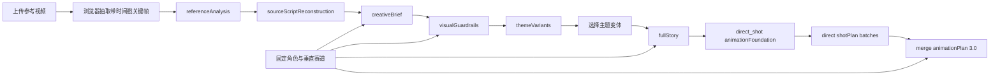

# AI 短视频导演工作流规范

## 1. 产品判断

本工作流不以“和原片越不一样越好”为目标。质量标准由两组同时成立的约束构成：

- 体验保真：同定位、同受众、同核心情绪、同类剧情驱动力、同款高价值桥段。
- 表达原创：具体人物、任务、道具、对白、场面调度和镜头表达重新设计。

抽象母题与具体表达必须分开处理。送达任务、旅途结构、情感媒介、获得帮助、被关爱对象、天气或空间推动情绪、生活化或仪式化结尾属于通用叙事构件，可以继续使用；独特台词、专有名称、罕见动作组合、独特道具组合和逐镜对应才进入禁止复制项。

## 2. 处理流程

### 阶段一：referenceAnalysis

必须回答：

- 内容定位、目标受众、故事梗概。
- 主角、配角、人物关系、主角职业或社会身份。
- 被关爱对象的身份、显性需求和隐性需求。
- 对白风格、镜头节奏、情绪曲线。
- 观众为什么愿意看完。

所有关键判断需要引用采样画面编号（F1、F2……）或用户补充文本。无法确认的内容进入 `uncertainties`，不得伪装为事实。

`referenceAnalysis.observedFacts[]` 是结构化视觉证据层。每项只保存一个直接可见 observation、受控 `factType`、`core/supporting` 重要度，以及结构化的 frame 或 video `evidenceRefs`。原生视频证据只使用整数 `startSecond/endSecond`，最大整数结束秒必须严格小于输入视频时长加 1 秒；模型不得输出毫秒字段。完整 `referenceAnalysis` 会作为下一阶段的分析上下文，但人物动机、隐性需求、叙事意义等判断不能冒充画面直接证据。分析结果由服务端签名并绑定当前 transcript、关键帧与原生视频；客户端改写或跨素材复用后必须重新分析。原生视频模式的首次候选若仅以 `VIDEO_EVIDENCE_TIME_INVALID` 失败且已有关键帧，系统丢弃该候选，不回传其 Artifact 或错误子树，改用同一模型和既有关键帧重新执行一次 frames-only 取证；该调用是媒体证据重新获取，不是内容 repair，frames-only 结果仍失败时立即终止。签名前只接受本次实际媒体模式对应的 evidence，不能引用模型本次没有实际收到的视频时间段。

### 阶段二：sourceScriptReconstruction

本阶段恢复为完整可读脚本还原。模型同时接收参考视频或采样画面、`referenceAnalysis`、视频元数据和用户补充字幕，按场输出：

- `timeRange`、`location`、`characters`、`visibleActions`；
- `dialogueGist`、`shotDesign`、`emotionNode`、`dramaticFunction`；
- `turningPoint`、`keyProps`、`sourceEvidence` 与 `confidence`；
- 全片 `coreEventSequence`、`relationshipPattern`、`endingAction`、`turningPoints` 和 `uncertainties`。

“完整还原”指在现有证据范围内覆盖开场、发展、转折和结尾，不等于填满采样间隙。未提供音频转写时，只能概括可确认的对白功能。`sourceEvidence` 继续使用 Reference Analysis 中已有的画面编号、时间码或用户补充文本；无法确认的身份、对白、动作和因果关系必须进入 `uncertainties`。

服务端仍会为 Analysis 和 Reconstruction 附加完整性签名，并将 Reconstruction 与当前素材上下文绑定，防止客户端篡改或跨素材误配。签名只保护通过契约校验的完整脚本，不再把脚本降级为 `sourceFacts`/`factRefs` 引用图；下游 Creative Brief、视觉规则和完整剧情会消费验签后的完整可读字段。

### 阶段三：creativeBrief

`creativeBrief` 是后续创作的唯一结构依据，必须包含：

- `storyEngine`：欲望、阻碍、升级、转折机制、回报。
- `emotionStructure`：每一阶段的剧作功能与目标情绪。
- `roleAndOccupationMapping`：原片角色功能如何映射到固定角色和赛道身份。
- `reusableHighValueBeats`：桥段价值、必须保留内容和可改变表面。
- `controlledRewriteVariables`：需要受控改写的变量。
- `protectedExpressions`：记录原片具体表达及其来源；字段名保留兼容，但不作为下游正文禁词。
- `minimumTransformationRules`：最低变换规则及验收检查。
- `allowedNarrativeComponents`：七类通用构件的安全复用方式。`component` 由服务端固定为送达任务、旅途结构、情感媒介、获得帮助、被关爱对象、天气或空间推动情绪、生活化或仪式化结尾；Prompt 展开完整七项，模型只填写非空的 `howToReuseSafely`。即使不采用也必须保留分类并说明限制，禁止改名、合并、省略、重复或增加分类。每条 `howToReuseSafely` 必须以 `【原片有】` 或 `【原片没有】` 开头作出存在性判定，缺少前缀时校验失败；判定只陈述原片既有事实，不得用一条针对新片的正向复用指令绕过。`【原片有】` 必须用「」引出上游依据并被回查核对，判据为字符覆盖率 ≥ 0.75，允许转述。
- `nonNegotiableExperience`：五项体验保真要求。

`controlledRewriteVariables.sourceValue` 和 `protectedExpressions.sourceExpression` 若列举同类具体物品，每个名称必须重复完整中心名词，例如“绿色邮箱、红色邮箱、蓝色邮箱”，不得缩写为“绿色、红色、蓝色邮箱（组合）”。这项约束只负责完整表达上游已有事实，不得新增物品，也不得由本地语法规则反向猜测旧缩写。`visualGuardrails.sourceSimilarityRules[].sourceExpression` 另有确定性校验：每个并列项必须逐字出现在同一条规则的 `triggerEvidence[].evidence` 中，补全或拼接即 fail closed；保留上游原文是合法退路。

这两类来源字段不会自动禁止下游复用对应表达。原片道具、拟声词和角色组合可以按当前选定剧情出现在 Variant、Legacy Full Story 与 Animation Plan 的任意正向业务字段，包括 `visibleAction`、对白、声音与 `videoPrompt`；但来源上下文本身不是使用指令，不得据此机械注入正向内容。该放行不授权修改固定主角，固定主角的签发身份与外观仍由 `fixedCharacterBoundary` 唯一约束。

### 阶段四：visualGuardrails

`visualGuardrails` 是固定角色语义唯一生成阶段，只负责一次性确定并签发全局角色边界，不负责生成最终图片或视频负面提示词。它同时读取用户角色描述、参考分析、脚本还原和创意简报，并允许视觉模型用通用常识补全用户采用的角色原型；不使用本地物种关键词字典。用户明确肯定或否定的描述优先于模型常识，无法消解的冲突必须进入 `unresolvedConflicts` 并阻断下游。输出必须拆成：

生产环境必须校验 `fixedCharacterBoundary` 的 HMAC 签名。本地 `test`/`development` 只有在服务端同时配置 `WORKFLOW_SIGNATURE_POLICY=test_package_unverified` 时才跳过签名比较，以便服务重启后继续回放测试包；`sourceDigest` 与 `boundaryDigest` 仍然强制校验，不能复用其他素材、用户设定或被改写过的边界。

- `fixedCharacterBoundary.requiredTraits`：后续角色参考、剧情扩写、动画规划和生成请求必须沿用的身份、外观、性格、职业或剧情功能事实；每项带 `explicit | inferred` 证据等级和模型生成的同义词。
- `fixedCharacterBoundary.allowedTraits`：允许按剧情选择使用、但不要求每个角色参考都出现的事实。
- `fixedCharacterBoundary.forbiddenTraits`：与已确定角色形象冲突、后续正向字段不得出现的事实。
- `allowedPositiveTraits` 与 `positivePromptBoundary`：由服务端从上述全局边界确定性派生，模型不得另写第二份角色事实。
- `sourceSimilarityRules`：记录原片表面表达的 provenance，不是下游正文禁词；只有生成请求实际传入原片视觉参考时，相关 evidence 才能在该次请求中为 `reference_leak` 提供依据。
- `dialogueRules`：只记录用户明确提出的角色口癖、可用拟声词或禁用对白；不得从原片对白、拟声词、Creative Brief 来源字段或 `sourceSimilarityRules` 自动生成。台词规则不得进入图片负面提示词。

服务端将边界与当前 `creatorProfile`、`referenceAnalysis`、`sourceScriptReconstruction` 和 `creativeBrief` 的摘要绑定并签名。Variants、Legacy Full Story、Animation Plan、人物参考精修、角色图、旧 v2 首尾帧和视频生成只消费验签后的边界，不再解析 `fixedCharacter` 或调用模型常识重算。旧 v2 兼容路径中的 Character Feature Compiler 也只能编译已签发 `requiredTraits(scope=appearance)`，不能重新推断固定主角。用户修改角色设定、字幕、参考视频或上游创意数据后，旧边界立即失效并要求重新生成。

`sourceSimilarityRules.sourceExpression` 与相关 evidence 沿用同一完整名称规则。若旧 Brief 或 Visual Guardrails 已签发“绿色、红色、蓝色邮箱组合”这类歧义缩写，系统不得把“红色”自动扩写为“红色邮箱”；必须重新生成对应上游 Artifact 后再进入下游。下游不得把这些来源表达编译成正文黑名单，也不得仅因词面命中而拒绝 Variant、Full Story 或 Animation 正向字段；只有实际传入原片参考时，才能把受信 evidence 用于 `reference_leak` 判断。

该阶段没有 `commonNegativePrompt`，也不维护“未声明身体部件”的完整枚举。未声明不等于禁止；只有全局边界明确写入 `forbiddenTraits` 或存在当前镜头的有效失败证据时，相关概念才可参与后续拦截或逐镜负面词判断。

### 阶段五：themeVariants / Story Candidates

`themeVariants` 的 wire shape 与 Artifact 名称保持不变，但其中每个 `variants[]` 项按严格 Story Candidate 契约校验。所有对象递归拒绝未知字段；候选继续复用现有任务、压力、剧情节拍、结尾仪式与保真/原创性字段，只新增五个候选级字符串：`keyChoice`、`climax`、`emotionalPayoff`、`novelty`、`visualPotential`。这些字段是选题层摘要，不包含 Full Story、人物圣经、分场、镜头或 Animation Plan 数据。

每个 Story Candidate 必须可独立拍摄，并提供两组验收证据：

- `experienceFidelity`：逐项说明定位、受众、情绪、驱动力和高价值桥段如何保留。
- `transformationProof`：逐项说明人物、任务、细节/道具、对白和视听表达实际发生的改编；不要求每个原片表面表达都必须替换。

只替换姓名或职业不算候选分化。多个候选至少要有两个不同的确定性结构签名；签名只投影 `dramaticFunction` 序列、`keyChoice`、`climax` 和 `emotionalPayoff`，不靠老人、下雨、礼物等题材关键词判断差异。本地校验只检查严格字段、候选 id、Beat 连续编号、固定主角与结构签名，不判断“选择是否有意义”或“情绪是否成立”等纯语义质量。

每个候选至少有一个主要承担角色性格或人物关系质感的 Beat，但该 Beat 仍必须改变关系状态、情绪状态、信息状态或后续选择条件；删除后必须使角色弧线、关系推进、情绪积累或后续因果至少损失一项。候选仍必须产生新的具体任务、环境压力、情感媒介、帮助方式和结尾仪式。

用户明确选择候选时，浏览器把完整 Candidate 提交为 `variant:<id>` Artifact。Full Story 请求必须另带该 Artifact 的精确 `artifactId/revision/contentDigest`；服务端在模型调用前后都从 Run 读取 current Artifact，核对请求副本的 canonical digest，并只把服务端落盘内容交给既有 Full Story 流程。`candidateBinding` 仅是请求 sidecar，不进入 Prompt、Legacy Full Story wire shape 或 Artifact 内容。同一 id 下任一内容变化都会换 digest/revision，旧请求与旧下游不再 current。

页面恢复时，current Full Story 或 Animation Plan 可恢复其 `selectedVariantId`；没有下游时，只有 current `variant:<id>` 明确选择记录才能恢复。仅有 `themeVariants` 时保持 `selectedVariantId = null`，禁止从 `variants[0]` 默认选中。

Phase 2 的预留接缝只是「已签发 Candidate 内容 + 精确 lineage reference」：未来 Blueprint 若实施，必须消费这一对受信输入，不能再只用 id 猜候选。当前没有 Story Selection/Blueprint Artifact、API 或额外 LLM 调用。离线质量基线的输入、结果与人工评分边界见 `docs/story-quality-evaluation.md`。

### 阶段六：fullStory

用户选择一个 `themeVariants.variants[]` 后，进入独立完整剧情页。该阶段不重新发散主题，只围绕被选中的主题变体扩写，输出：

- `characterBible`：锁定固定角色、被关爱对象、帮助者与对白规则。
- `beatSheet`：45–90 秒短视频的完整剧情节拍。
- `sceneScript`：可拍摄分场，包含地点、人物、可见动作、对白、镜头/声音、情绪节点和剧作功能。`characters` 只写本场实际出镜角色，数组必填但允许空数组——无人出镜的空镜（雨水、道具特写、建立镜头、人物离开后的空镜、纯转场环境镜头）正确值就是 `[]`，整片则至少要有一个场次非空，否则抛 `FULL_STORY_NO_VISIBLE_CHARACTER_SCENE`。可选的 `offscreenSoundSources` 登记只以声音出现、明确不出镜的角色名。`shotAndSound` 同时承载画面描述与声音来源，程序不得靠正则或关键词区分，因此扫描按字段职责分档：`visibleAction` 只认 `characters`，`shotAndSound` 认两者并集。登记只豁免 `shotAndSound`、绝不豁免 `visibleAction`，所以无法靠登记声源隐藏出镜角色；同名同时出现在两个字段时明确失败不选边；`dialogue[].speaker` 仍必须逐字存在于同场 `characters`。
- `keyProps`、`shootingPlan`、`retentionPlan`：进入拍摄筹备需要的道具、场景和完播设计。
- `experienceFidelity` 与 `transformationProof`：继续证明同定位、同受众、同情绪、同类驱动力、同款高价值桥段，并记录实际发生的具体改编；复用某个来源表达本身不构成失败。
- `continuityAndSafetyCheck`：确认固定主角服从签发边界且剧情连续；不得把 `protectedExpressions` 的词面复用本身判为失败。

完整剧情阶段可单独切换文本模型：默认路由由现有 Qwen/MiMo 配置决定；配置 `DEEPSEEK_API_KEY` 后，页面可以显式选择 `deepseek-v4-flash` 或 `deepseek-v4-pro`。DeepSeek 不自动接管默认路由，不允许用于任何带图片或视频输入的阶段。

#### Legacy Full Story 有界子树纠错

首次模型 completion 已解析为完整 JSON 对象，且全部结构化 diagnostics 都精确指向 `/characterBible/protagonist/name` 的 required/type/empty-string 错误、当前验签固定角色边界提供唯一姓名时，唯一一次 retry 使用内部 `full_story_partial_repair/1.0` 协议。服务端只发送 protagonist 的 `currentValue`、diagnostics、`mutableFields:["name"]`、`expectedFields.name`，以及最小只读的固定角色名、标准角色名、Variant ID 和 sceneId 列表；不发送完整失败 Story，也不重复原始完整生成 Prompt。任何未知正文或其他字段错误都不得签发 Full Story 计划。

服务端为目标签发固定 `repairId`、原候选 `baseDigest`、authorityDigest 和仅当前进程持有的私有计划身份；计划的序列化副本不能用于合并。模型只能返回一个 `{repairId,replacement}`；不能选择 path、返回 patch、删除其他字段或增加 operation。replacement 是 protagonist 对象的完整值，但 `name` 必须逐字等于 `expectedFields.name`，对象内其余已有合法字段和所有目标外数据必须保持不变。

服务端在原候选 clone 上原子合并，验证私有计划身份、候选摘要、当前权威摘要、协议、目标内变更边界与目标外摘要，再从头执行 Legacy exact JSON Schema、Scene Contract、固定角色/Profile 和 Variant 全链校验。初轮生成阶段固定为 primary + 最多一次 retry/repair；第二次仍失败时不得进入后述 Beat–Scene postpass。除上述 protagonist `name` 安全子集外，其他角色姓名或身份字段缺失/错误、`characters` 与 `visibleAction`/`dialogue` 的跨字段冲突，以及没有签发值来源的必填剧情字段都直接失败；不得让 replacement 通过角色改名、删除动作/对白或另编剧情来消除错误。截断、JSON 语法或供应商协议错误因为没有可合并 candidate，仍使用既有 completion retry；已解析但路径不可信、details 为空、目标不存在或整项内容丢失时明确失败，不能静默发送完整 Story 重写。该机制是模型局部重生成，不是本地确定性搬字段、独立语义审计或 Full Story v2。

#### Legacy Full Story Beat–Scene 提交前复核

初轮候选（包括实际发生的唯一允许 retry 或 protagonist `name` 局部纠错）只有在通过 Legacy exact JSON Schema、Scene Contract、固定角色/Profile、Variant 与既有语义边界的完整校验后，才能在 Artifact commit 前进入一次独立的 Beat–Scene AI postpass。它沿用本次 Full Story 明确选择的文本 provider/model；请求的业务内容严格只有完整、已合法的 Full Story JSON 和专用复核提示，不再发送 `creatorProfile`、Theme Variant、Creative Brief、Visual Guardrails、`referenceAnalysis`、Reconstruction、原片边界或其他上游数据。该调用不是失败候选 recovery，也不能作为第二份权威来源。

postpass 把 `beatSheet` 当作只读叙事目标，仅检查现有 `sceneScript` 是否遗漏会造成可拍叙事明显断裂的重要节拍、可见结果、状态变化或因果过渡。没有明显遗漏时返回 unchanged；存在遗漏时，模型不得自由生成 append suffix。每条提议必须绑定已有 scene 和唯一 `beatIndex`，其 `addition` 必须是对应 `beatSheet[beatIndex].storyAction` 的一段连续、逐字相同原文，并且包含该 review 逐字返回的 `beatEvidence`。全部证据只能使用该 `storyAction` 与目标/相关场次当前 `visibleAction` 的逐字 excerpt；不得引用其他 Story 字段、上游数据或模型常识。无法从 `storyAction` 连续逐字投影所需内容时必须返回 `blocked`，不能释义、改写或拼接多个不连续片段。

服务端最多接受 3 个已有目标场次；每条 `addition` 最多 600 字，全部 additions 合计最多 1200 字。合并时只把受信 `addition` append 到对应 `sceneScript[i].visibleAction`，原字符串必须仍是逐字前缀。场次数量与顺序、`sceneId`、`timeRange`、`location`、`characters`、`offscreenSoundSources`、`dialogue`、`shotAndSound`、`emotionNode`、`dramaticFunction`、`shootingNotes` 以及 `sceneScript` 外的所有字段逐字冻结。合法省略、蒙太奇概括、末项代表整组或既有终态已经提供证据时不得重复投影；超限、`beatIndex`/`beatEvidence` 错绑、addition 未包含 `beatEvidence` 或非对应连续原文，以及新增场次、改角色、改对白、改地点或重写原动作都属于协议错误。

正常路径是 primary + postpass，共 2 次 provider call；初轮消耗唯一允许的 retry/repair 后才成功时，再执行 postpass，整个 Full Story operation 最多 3 次，禁止第四次调用。postpass 返回 `blocked`、协议错误、供应商错误、额外字段、越界 diff、非追加式变化或最终完整复验失败时一律 fail closed：不把初轮候选保存为 fallback，不追加另一轮 postpass，也不回退整包重写。服务端只在 clone 上合并已验证为对应 `storyAction` 连续逐字原文的 `addition`，并从头执行 Full Story 全部校验；最终 unchanged 或合法 append 的 Story 只提交一次 Artifact。初轮候选、postpass 响应和合并中间态均不创建 Artifact revision、Checkpoint 或第二份 Story。

#### 当前主流程的通用有界纠错协议

除 Full Story 的专用子树协议外，当前主流程使用 `artifact_partial_repair/1.0` 统一编排 Animation 内容纠错。validator 必须先返回服务端生成的稳定 `code/jsonPointer/reason`；stage adapter 再决定 target、允许变化的绝对 Pointer、最小 authority 与完整只读 validator。通用内核不解析错误 message，也不允许模型选择 path。

当前接入点只有两类：

- Animation Foundation：只有已签发边界中唯一固定角色参考，且全部错误都是缺失 `requiredTraits` 或该参考叶子命中禁止特征时，才把这一个角色参考对象交给模型。纯缺失错误只授权 `consistencyTags`，要求保留原数组顺序并在尾部按边界顺序追加缺失 trait 的 exact `canonicalName`，`appearancePrompt` 逐字冻结；同义 term、重排、重复或额外事实均拒绝。禁止表达只授权 diagnostics 实际命中的字段做受限删除；混合错误取命中字段与 `consistencyTags` 的并集，但缺失事实仍不得写入外观、身份或剧情职责。配角、重复/缺失主角引用、正向场景 Prompt 命中或边界不可信都直接失败。
- 最终语义 Prompt 审计：完整 Plan 确定性校验后，服务端签发逐镜证据目录并要求审计逐镜比对结构化事实与 `videoPrompt`；只有全部结构化事实通过、失败项精确属于 `videoPrompt` 时，才允许一次有界 Prompt 修复。

任何已经解析但没有 adapter/可信 target 的内容错误都 fail closed，不发起第二次整包生成；repair 协议、authority、replacement 或完整复验失败同样终止。内容 repair 最多 primary + 一次局部调用。上述 `referenceAnalysis` frames-only 再取证是丢弃失败候选后的媒体证据重取，不是 repair。供应商/网络错误、签名或 lineage 冲突不是内容纠错，不能走该协议。旧 v2 首尾帧兼容路径仍是历史实现，不属于本节的当前 `direct_shot` 行为。

#### 有界局部纠错 Debug sidecar

只有 stage adapter 已成功签发 repair plan 时，服务端与 `run:video` 才在 `debug/partial-repairs/<UTC>-<stage>-<UUID>/` 建立一次观测 session，并在第二次 provider call 之前完成前两项写入：

1. `01-trigger.json`：原始错误、结构化 diagnostics、签发 target 的 currentValue、最小 authority 和摘要；
2. `02-repair-prompt.txt`：实际发送的局部 repair Prompt；
3. `03-model-response.json`：收到的 replacement 最小投影，额外字段只记录字段名而不记录值；
4. `04-result.json`：当前 repair adapter 完成合并/阶段复验后的 `repaired | rejected` 结论和脱敏拒绝原因；H3 的 `repaired` 不代表后续最终 Plan 语义审计或 Artifact 提交已经完成。

Plan 为 `null`、错误不可定位、候选不完整或属于 transport/lineage 问题时不创建该目录。记录器不得接收完整 Story/Foundation/Animation Plan 或原始 HTTP 响应，并递归脱敏 Header、密钥、Cookie、签名、Data URL 与 Base64 媒体。目录和文件使用私有权限与原子写入；单次写入失败只产生脱敏告警，不能覆盖业务错误、改变调用预算、补发模型请求或 fallback 保存 raw。`PARTIAL_REPAIR_DEBUG_DIR` 只能改变本地落盘目录，不能改变 repair 策略。

#### Full Story 全量模型输出 sidecar

Full Story 的完整 completion 观测与上述 repair Debug 是两套互斥职责的记录器。只有服务端环境显式配置 `FULL_STORY_MODEL_OUTPUT_LOG_DIR` 时，`ModelCallCoordinator` 才为 Full Story 的每个 primary、实际 retry/repair 与 Beat–Scene postpass attempt 按阶段原样保存 `completion.content`，不复用会按 256 KiB 截断且 30 分钟过期的 AttemptStore。日志不保存输入 Prompt、供应商 HTTP envelope、Header、密钥、Cookie 或任何媒体。浏览器把已有 Production request token 放在旁路 Header；服务端按 `projectId/runId/fullStory:<variantId>/requestId/expectedCurrentRevision` 核对 current running stage 后才标记为 verified，并明确区分 production requestId 与 provider requestId。无 Header 的直接 API 调用可记录为 unbound，但不得搜索其他 Run 猜归属。

每个 attempt 使用私有目录与文件权限、临时文件加原子 rename，日志 metadata 以明确的 `stage` 保存 primary、retry/repair 或 Beat–Scene postpass 阶段，并记录模型、状态、时间、字节数与 SHA-256；模型正文不截断。配置路径位于 `public/` 时禁用。任何验证上下文或写盘错误都只能产生脱敏告警，不得影响 Story Prompt、输出校验、重试/repair/postpass 次数、HTTP 结果或 Artifact commit。全量日志不会写入 manifest、Artifact、Checkpoint、包或导出 JSON，也不能用于恢复/合并失败 Story；它只证明某次模型 completion 实际包含什么文本，不能单凭词命中判定该文本是正向剧情还是负向规避说明。

#### Animation Plan 全量模型输出 sidecar

只有服务端显式配置 `ANIMATION_PLAN_MODEL_OUTPUT_LOG_DIR` 时，`/api/animation-plan` 才在当前异步请求上下文内观测真实 `/chat/completions` 响应。响应克隆只在内存中解析，落盘内容严格限于 `choices[0].message.content`、finish reason、数值 usage、provider requestId、模型名和调用顺序/阶段标签；原 HTTP envelope、请求体、Prompt、Header、密钥和媒体不得落盘。output-only 模式不会创建现有 Animation Prompt 抓取文件。

浏览器沿用 Production request Header；服务端只有在 `projectId/runId/animationPlan:<variantId>/requestId/expectedCurrentRevision` 与 current running stage 完全一致时才标记 verified。缺失或不匹配时可写 unbound 日志，但不得猜测归属或影响生成。当前 direct-shot 首次 Plan 可观测 Foundation primary/局部 repair、各镜头批次 primary、实际发生的 H3 shot prompt 局部 repair、无 parsed candidate 时的批次 second-pass，以及最终合法 H3 Plan 的首次语义审计；未进入的阶段没有日志。每条 `model-output.txt` 是 provider 原始 completion 文本，不是 parsed candidate、Artifact 或事实源；观测、克隆、解析或写盘失败均 fail-open，validator、调用预算、repair 决策、错误文字和 Plan commit 必须保持不变。

### 阶段七：animationPlan

完整剧情生成后，可以继续生成用于 AI 视频制作的 `animationPlan`。当前临时主流程必须由请求显式传入 `animationPlanMode: "direct_shot"`，输出携带 `promptSchemaVersion: "3.0"`，且 `productionStrategy.format` 为 `direct_shot_video`；不得因镜头缺少端点字段而自动进入此模式。

首次生成 direct-shot Plan 时，浏览器仍必须传入当前用户明确选择的镜头视频模型（Seedance 2.0 或 MiniMax H3），服务端据此签发 `videoPromptProfile`。方言只有一种，运行时模型不改变提示词写法，因此之后切换视频模型不再触发改写询问。

浏览器还必须显式传入 `targetAspectRatio`，当前只允许 `9:16` 或 `16:9`。首次生成时，Foundation 的 `productionStrategy.targetAspectRatio` 必须与用户选择逐字一致；已有计划切换画幅时，用户选择作为新的计划级输出事实，不调用模型、不重写 shot，并提交同一 Animation Plan artifact 的新 revision/media namespace。该计划级字段是后续视频请求的画幅事实源；不得向 exact direct-shot 字段集合增加逐镜 `aspectRatio`。需要重新设计镜头构图时，用户再显式触发完整 Plan 重生成。

页面和 Markdown 的“镜头计划合计时长”由全部 `shotPlan[].durationSeconds` 求和派生；3.1 起 `productionStrategy.targetRuntimeSeconds` 由服务端注入为同一个合计值（= 各场 `timeRange` 跨度之和），两者定义上相等，偏差恒为 0，`mergeAnimationPlan` 对此有硬断言。“单镜头”一栏改为从实际 `shotPlan` 汇总区间，`recommendedShotDurationSeconds` 在 direct_shot 已删除。该合计是计划时长，不等同于供应商生成媒体经探测后的实际文件时长。

当前 `direct_shot` 仍先生成不含 `shotPlan` 的 foundation，再按 `fullStory.sceneScript` 分批生成镜头并按剧情顺序合并。`visualBible`、`characterReferencePrompts`、`sceneReferencePrompts`、`assetPrompts`、`editPlan` 与 `generationChecklist` 继续承担全局视觉锁、引用、剪辑和质检职责。每个 shot 保留：

- `shotId`、`sourceSceneId`、`sceneId`、`durationSeconds`、`storyPurpose`、`emotionalTarget`；
- `videoPrompt`、`cameraMotion`、`characterAction`、`dialogueOrSubtitle`、`soundDesign`、`continuityNotes`；
- `negativePrompts` 与 `acceptanceCriteria`。

`videoPrompt` 是模型直接签发的一条自包含中文自然语言完整视频渲染指令，Seedance 2.0 与 MiniMax H3 消费同一条提示词。

Foundation 与全部 shot 合并并通过完整契约校验后，服务端还要单独调用文本模型执行逐镜、证据绑定的语义审计；结构化事实 fail 时停止评估 `videoPrompt` 且不得修 Prompt。

已有 Plan 后切换镜头视频模型的状态转移必须明确：先保留用户的新运行时模型设置，再比较目标 Profile 与 Plan Profile，并询问是否重新生成提示词；旧 Plan 缺失 Profile 同样视为 mismatch，禁止从现有 Prompt、provider 或模型名反推。拒绝时 Plan JSON、revision、media namespace 与媒体 current/stale 状态均不变化，新模型设置也不回滚；确认时只调用“视频提示词目标改写”，输入当前签发 Plan，输出与现有 shotId 顺序一一对应的 `videoPrompt`，服务端更新 Profile 并逐字保留全部其他 Plan 字段。完整契约校验后执行同一套证据审计；只有纯 Prompt 实质冲突可在提交前进行唯一一次有界修复与复审。只有最终改写、完整校验和审计都成功后才提交新的 Plan revision/media namespace，并递归 stale 旧媒体；任何失败都让旧 Plan 继续 current。首次 H3 Plan 与确认 Profile 改写都要求已配置的实时文本模型；demo mock 不得伪造英文翻译、语义审计结果或生产 Profile。合法反例：3 秒 shot 不满足两家供应商的 4 秒下限，Prompt-only rewrite 无权改变 `durationSeconds`，因此确认改写必须失败并要求完整重生 Plan；拒绝重写虽然保留 Plan，但运行时也必须拒绝该镜头，不能钳制为 4 秒或 fallback。3.1 起这类镜头在骨架派生阶段就已经被拦下。

`direct_shot` 3.1 把 `fullStory.sceneScript[]` 的每一项直接定义为最终可翻拍业务镜头，Animation Plan 不再拆镜，只填内容。镜头骨架由服务端在任何模型调用之前从 Full Story 确定性派生：`shotId`（全局 `A01`、`A02`……）、`sourceSceneId`、`sceneId`、`durationSeconds`、`storyPurpose`（= `dramaticFunction`）、`emotionalTarget`（= `emotionNode`）全部由服务端签发，模型回显错了按骨架确定性覆盖。唯一的拆镜条件是单场跨度超过 15 秒：按 `ceil(跨度 / 15)` 均分，余数逐秒给靠前的镜头；其余情况严格一对一，禁止拆分、合并、新增、遗漏、重排或改写时长。任何输入中的景别、机位、构图、焦段、运镜或转场建议都只能决定已划定业务 shot 内部的摄影/剪辑表达，不得生成额外 `shotPlan[]`；同一 `videoPrompt` 可以按顺序描述中景跟随、关键动作特写、硬切或结尾宽景。`shotAndSound` 与 `shootingNotes` 继续提供摄影和声音参考，但不是镜头数量的事实源。镜头时长就是 `timeRange` 的派生结果，落在 Seedance 2.0 与 MiniMax H3 的能力交集 4–15 秒整数内；项目不再另设 4–6 秒子集，`timeRange` 不可解析、跨度非正、跨场次逆序或短于 4 秒时明确失败，不能钳制、补长或缩短。内部摄影变化允许但不强制，必须优先保证完整动作链。使用内部切换时，1–3 条验收标准必须覆盖动作顺序、可见终点和关键摄影切换，失败不得静默加镜或删动作。

#### 旧 v2 首尾帧兼容路径

旧 v2 计划携带 `promptSchemaVersion: "2.0"`。其逐镜结构如下：

- `startFrame` / `endFrame`：`timeAndWeather`、逐角色位置/朝向/姿态/手持物/视线/表情、前中后景、摄影机规格、物理光源、风格修饰和连续性锁；两端都必须是可独立生成的完整静态规格。
- `motion`：一个 `primaryAction`，`locked` 或 `continuous` 摄影机，起止情绪与可见表演，环境/光线变化，1–4 个连续覆盖 0–100% 的 `timingBeats`，对白/环境声/音效，以及到达尾帧后的停止条件。
- 固定摄影机要求两端核心机位一致；连续摄影机允许机位变化，但必须声明技术、路径、速度和动机。普通 shot 不允许切镜或更换地点；循环镜头必须回到兼容首帧的状态。
- `postRetime` 只记录后期变速建议，不发送给生成模型。项目配乐仍在后期统一，逐镜音频只负责对白、环境声和同步音效意图。

兼容字段 `startFramePrompt`、`endFramePrompt`、`videoPrompt`、`cameraMotion`、`characterAction`、`dialogueOrSubtitle`、`soundDesign`、`continuityNotes` 全部由共享编译器确定性生成。模型不得同时撰写第二套字符串；若导入的 v2 数据同时带结构和不一致的兼容字段，契约校验直接失败。

旧 v2 服务端兼容路径仍拆成三步，但 `POST /api/animation-plan` 的请求和最终响应保持不变：

1. 生成 `animationFoundation`：只生成 `visualBible`、角色/场景/资产参考和其他全局字段，不生成、占位或推测 `shotPlan`。场景参考使用服务端私有 `sourceSceneIds` 锁定剧情场次与 `sceneId` 的唯一映射；共享地点可将多个场次映射到同一场景。
2. 按 `fullStory.sceneScript` 每 2 场分批生成仅含 `{ "shotPlan": [...] }` 的结构化镜头结果。每批只能覆盖指定 `sourceSceneId`，且 shot 必须使用基础阶段锁定的对应 `sceneId`。当前批会与前面已通过的镜头一起校验；包括跨批重复负面词在内的错误，都只使用现有纠偏机制重试当前批。
3. 服务端按剧情顺序合并，统一编号 `A01...`，保留三类结构化对象，编译兼容字符串，同步重写逐镜负面词的 shot 证据路径，重算 `sceneReferencePrompts.relatedShotIds`，然后再执行一次完整 `animationPlan` 契约、正向边界和负面词相关性校验。下一批会收到上一镜完整 `endFrame` 与运动终态，而不是只收到一段尾帧散文。

分阶段结果是服务端私有结构，不写入前端状态或导出文件。旧 v2 合并结果同时包含结构和兼容字符串；无 `promptSchemaVersion` 的更早计划继续按 legacy 字符串读取，不尝试从散文反推结构。这些兼容规则不得为 `direct_shot` 补写端点字段。

#### 两种契约共用的逐镜负面提示词

每条逐镜渲染负面词必须包含：

- `text`：最终负面描述；
- `appliesTo`：`image`、`video` 或 `both`；
- `triggerEvidence`：一个或多个 `{ sourcePath, evidence }`，指向固定角色、当前分场动作、当前 shot prompt、真实参考输入或真实供应商失败记录；
- `reasonCode`：仅允许 `explicit_identity_conflict`、`shot_object_confusion`、`shot_interaction_failure`、`temporal_consistency_failure`、`reference_leak`、`proven_provider_failure`；
- `priority`：`high`、`medium` 或 `low`；
- 可选 `enabled`：设为 `false` 时表示停用，内置单镜头生成和外部供应商程序都不应将它编译进请求。

图片和视频数组都允许为 `[]`，不设最少条目数；其中 `direct_shot` 的图片数组必须严格为 `[]`，只交付视频负面词。没有可解析证据、仅以“用户未声明/未提及”为理由、媒介不匹配、把台词规则混入画面、或在没有实际原片参考输入时使用 `reference_leak` 的候选项，会在工作流相关性裁剪中删除；保留下来的非法结构会触发现有模型纠偏重试。不同 shot 不得无差别复制同一组负面词。

剧情页必须提供两个供应商交付出口：

- JSON 导出：当前测试/规划包版本为 `3.0`。服务端只对当前 Variant、Full Story 和可选 Animation Plan 的一致 lineage 签发摘要与本机 HMAC；导入先验证 package type/version/digest/signature/parent lineage，再建立隔离的新 Run，禁止与当前浏览器状态合并，且不信任包内旧媒体选择。
- Markdown 复制：当前 `direct_shot` 按逐镜 `videoPrompt`、运镜、角色动作、对白/字幕、声音、连续性、视频负面词和验收标准交付；旧 v2 才整理首帧、尾帧及其兼容字段。

页面内保留单镜头试片链路。`POST /api/generate-shot-video` 一律要求当前 Animation Plan 的 production context；服务端从该 Plan 的 `shotPlan[]` 唯一解析 `shotId`，忽略客户端自报的动作、时长、场景和负面词，不能由客户端省略 Schema 标记降级到无 lineage 的全局目录。弹窗允许编辑的视频提示词通过独立 `promptOverride` 传入，属于当前媒体请求的显式运行时覆盖，回执记录 `videoPromptSource` 与实际提示词；它不反向修改 Plan 的其他镜头事实。`generationMode` 是模式权威字段，不从端点字段缺失、provider、模型名或素材数量推断：

- `first_last_frame`：首帧和尾帧是精确端点，仍执行现有尾帧硬依赖校验；Kling、Seedance 与 MiniMax H3 均可使用。无端点的 `direct_shot` 不可使用该模式，必须明确失败，不能据此自动改选 `all_reference`。
- `all_reference`：请求中的 `referenceAssets[]` 是用户/角色/旧端点参考素材权威来源；可选的 `continuityReferenceMode` 只允许 `none | previous_shot_frames`，并且不能反向推断或改变 `generationMode`。当用户逐镜显式选择 `previous_shot_frames` 时，“上一镜”只能由当前签发 Plan 的 `shotPlan[]` 紧邻前项确定，服务端再从其 current `shotVideo:<variantId>:<shotId>` Artifact 读取当前选中候选，拒绝客户端自报的绝对路径、远程 URL、旧 namespace 或非相邻 shot。服务端用 FFmpeg 按 `t = 时长×i/4` 均匀截取 5 张 JPEG（首帧、末帧和中间三等分点，末帧回退 0.1 秒保证可解码），作为普通 `reference_image` 追加；张数固定不随时长变化，时间戳由 `previousShotFrameTimestamps()` 确定性计算并逐帧写进回执；首尾帧和角色图也只有在用户显式勾选后才作为普通参考图加入。该模式不生成或校验精确端点，不得混入 `first_frame` / `last_frame`。当前仅 Seedance 2.0 与 MiniMax H3 有已验证的 R2V API 协议；可灵当前 image-to-video 接入必须明确失败，不能静默降级。

这里的权威优先级按职责而不是按“文字更长”决定：用户对是否改写的明确确认只控制是否产生新 Plan；当前签发的 Full Story、exact shot、`fixedCharacterBoundary` 与 Foundation 锁控制剧情、身份、动作、时长、场景和声音；冻结参考 manifest 控制素材编号与角色；Plan `videoPromptProfile` 记录方言。`promptOverride` 只覆盖本次媒体文本，也不能越过 exact-shot 权威字段。

全能参考共同限制为图片最多 9 张、视频最多 3 段、音频最多 3 段，单段视频或音频 2–15 秒，视频与音频各自总时长不超过 15 秒，不能只输入音频，请求体不超过 64MB。上一镜实际抽帧与已有图片合并后共同计算 9 图上限；抽帧前先按实测时长预拒绝超过 9 张的输入，超限必须明确失败，不能丢弃角色图或静默减少抽帧。服务端以无符号链接文件句柄把上一镜冻结到当前任务私有临时目录，再按实际字节、ffprobe 时长和带超时的 FFmpeg 输出验证媒体；回执记录源视频 SHA-256 和每张抽帧的时间点/SHA-256。上一镜抽帧默认只表示 `intentional_next_shot` 的一致性弱参考：即使 `sourceSceneId/sceneId` 相同，也不能推断同一物理地点或无缝续拍；当前镜头的剧情动作、固定角色边界和目标场景优先，跨地点、跨时段、上一镜漂移或已完成动作可能被重演时应不勾选。两种模式均支持异步轮询、下载 mp4、1–4 个候选结果，以及回执中的 `negativePromptDelivery` 和脱敏 `requestPreview`；输出文件名包含每请求随机 nonce，写入后必须通过 ffprobe 验证存在可解码视频流和有效时长。

#### Production Lineage 与状态恢复

浏览器每次从视频输入重新运行主流程都会创建一个隔离 Run。每个成功阶段由服务端根据 canonical JSON 计算 SHA-256，签发单调 revision，并记录它实际消费的上游 `{ artifactId, revision, contentDigest }`。Variant 内容变化会使旧 Full Story 以及依赖它的 Animation Plan/媒体递归 stale；只改变对象键顺序不算内容变化。模型输出本身不得生成或修改 lineage。

前端在模型调用开始时冻结依赖 revision 与 `expectedCurrentRevision`。返回时同时检查本地 request token，提交时再由服务端检查 optimistic concurrency 和上游仍为 current；任一条件失败都拒绝回写。媒体还必须携带当前 Plan 的 `mediaNamespace`，目录与文件名同时绑定 project/run/plan revision/digest。使用上一镜抽帧的后镜 `shotVideo` Artifact 同时依赖当前 Plan 和上一镜 `shotVideo` 的精确 revision/digest；上一镜重生成或切换候选会递归使所有依赖它的后镜视频 stale，切换后镜自身候选时不得丢掉这条依赖。

服务端在 `runtime/production-runs/` 持久化 Run、Stage、Artifact、Checkpoint。页面刷新后可以恢复已完成 JSON artifact，并从最后 checkpoint 继续下游操作；原始上传视频和仍在执行中的远端模型调用不属于 checkpoint，刷新后不能自动续传或接管。完整契约见 `docs/production-lineage-state.md`。

仓库不提供 JSONL 任务队列、完整 production workspace、批量执行器、本地视觉质检、失败队列自动重试或 ffmpeg 成片合成。整片批量生成时，外部供应商程序负责把当前 `direct_shot` 的 `videoPrompt`、逐镜职责字段、`negativePrompts.video` 和验收标准映射到自身协议；只有旧 v2 兼容计划才映射首尾帧。

## 3. 模型与媒体策略

- 浏览器从本地视频均匀采样 6–10 张关键帧，最长边压缩到 720px；在 MiMo `auto/video` 模式且文件大小允许时，同时用 base64 `video_url` 发送原生视频。应用不持久化视频。
- `auto` 模式下，推理服务不接受原生视频时自动回退关键帧；超出大小限制时直接走关键帧。
- MiMo 多模态视觉输入必须在文本指令之前；用户消息末尾保留 `/no_think`，请求体同时设置 `thinking={"type":"disabled"}`。
- 默认阶段路由保持 Qwen 优先、MiMo 回退。DeepSeek 只在页面按阶段显式选择后参与创意简报、主题变体、Legacy Full Story、Animation Plan，或旧 v2 兼容路径的 Static Frame Compiler；默认模型为 `deepseek-v4-flash`，`deepseek-v4-pro` 为显式可选项，不静默回退。
- DeepSeek 请求只发送字符串文本，使用官方 OpenAI 兼容 `/chat/completions`、`max_tokens`、`thinking` 和 JSON Output。参考片分析、脚本还原、视觉规则、人物图修正属于媒体输入阶段，前端不提供 DeepSeek，服务端也会在 provider 调用前拒绝绕过请求。
- 当前实现通过小米 OpenAI 兼容 `/chat/completions` 接口连接 MiMo V2.5；原生视频使用 `video_url`，并携带 `fps=2`、`media_resolution=default`。Qwen 通过阿里云 Model Studio OpenAI 兼容 `/chat/completions` 接收文本、图片或视频。未配置服务时使用明确标注的演示模式。

## 4. 当前边界

- 项目固定使用 Node.js 24 LTS（见 `.nvmrc`，`package.json` 限定 `>=24 <25`）；验收测试应在该版本执行，避免把非支持版本或受限沙箱禁止监听本地回环端口造成的 native assertion 误判为业务失败。
- 原生视频过大或推理服务不支持 `video_url` 时会回退浏览器抽帧；快速剪辑、声音设计和未出现在采样帧中的动作可能遗漏。
- 音频尚未自动转写。需要准确对白时，应粘贴字幕/转写，或后续增加 ASR 阶段。
- 模型输出经过 JSON 解析、阶段契约校验和至多一次受控纠偏；Legacy Full Story 另经过内部 exact JSON Schema 与 Scene Contract。
