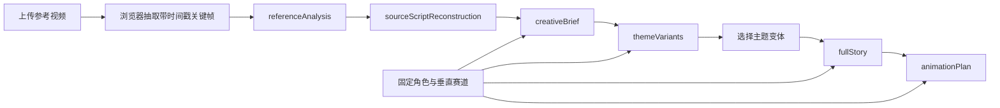

# AI 短视频导演工作流规范

## 1. 产品判断

本工作流不以“和原片越不一样越好”为目标。质量标准由两组同时成立的约束构成：

- 体验保真：同定位、同受众、同核心情绪、同类剧情驱动力、同款高价值桥段。
- 表达原创：具体人物、任务、道具、对白、场面调度和镜头表达重新设计。

抽象母题与具体表达必须分开处理。送达任务、旅途结构、情感媒介、获得帮助、被关爱对象、天气或空间推动情绪、生活化或仪式化结尾属于通用叙事构件，可以继续使用；独特台词、专有名称、罕见动作组合、独特道具组合和逐镜对应才进入禁止复制项。

## 2. 处理流程



### 阶段一：referenceAnalysis

必须回答：

- 内容定位、目标受众、故事梗概。
- 主角、配角、人物关系、主角职业或社会身份。
- 被关爱对象的身份、显性需求和隐性需求。
- 对白风格、镜头节奏、情绪曲线。
- 观众为什么愿意看完。

所有关键判断需要引用采样画面编号（F1、F2……）或用户补充文本。无法确认的内容进入 `uncertainties`，不得伪装为事实。

### 阶段二：sourceScriptReconstruction

按场输出时间、地点、人物、可见动作、对白大意、景别与镜头、情绪节点、剧作功能、转折点、关键道具和证据置信度；另行输出核心事件顺序、关系模式和结尾动作。

“完整还原”指在现有证据范围内覆盖开场、发展、转折和结尾，不等于填满采样间隙。未提供音频转写时，只能概括可确认的对白功能。

### 阶段三：creativeBrief

`creativeBrief` 是后续创作的唯一结构依据，必须包含：

- `storyEngine`：欲望、阻碍、升级、转折机制、回报。
- `emotionStructure`：每一阶段的剧作功能与目标情绪。
- `roleAndOccupationMapping`：原片角色功能如何映射到固定角色和赛道身份。
- `reusableHighValueBeats`：桥段价值、必须保留内容和可改变表面。
- `controlledRewriteVariables`：需要受控改写的变量。
- `protectedExpressions`：真正禁止直接复制的具体表达。
- `minimumTransformationRules`：最低变换规则及验收检查。
- `allowedNarrativeComponents`：七类通用构件的安全复用方式。
- `nonNegotiableExperience`：五项体验保真要求。

### 阶段四：themeVariants

每个主题变体必须可独立拍摄，并提供两组验收证据：

- `experienceFidelity`：逐项说明定位、受众、情绪、驱动力和高价值桥段如何保留。
- `transformationProof`：逐项说明人物、任务、细节/道具、对白和视听表达如何改变。

只替换姓名或职业不算主题变体。变体必须产生新的具体任务、环境压力、情感媒介、帮助方式和结尾仪式。

### 阶段五：fullStory

用户选择一个 `themeVariants.variants[]` 后，进入独立完整剧情页。该阶段不重新发散主题，只围绕被选中的主题变体扩写，输出：

- `characterBible`：锁定固定角色、被关爱对象、帮助者与对白规则。
- `beatSheet`：45–90 秒短视频的完整剧情节拍。
- `sceneScript`：可拍摄分场，包含地点、人物、可见动作、对白、镜头/声音、情绪节点和剧作功能。
- `keyProps`、`shootingPlan`、`retentionPlan`：进入拍摄筹备需要的道具、场景和完播设计。
- `experienceFidelity` 与 `transformationProof`：继续证明同定位、同受众、同情绪、同类驱动力、同款高价值桥段，同时重写具体表达。
- `continuityAndSafetyCheck`：确认固定角色没有被原片表面身份污染，也没有复用 protectedExpressions。

完整剧情阶段默认调用 `mimo-v2.5-pro`，通过 `MIMO_STORY_MODEL` 单独配置；其余四阶段默认仍用 `MIMO_MODEL=mimo-v2.5`。

### 阶段六：animationPlan

完整剧情生成后，可以继续生成用于 AI 视频制作的 `animationPlan`。该阶段不直接调用具体视频模型，而是输出模型无关的首尾帧生产包：

- `productionStrategy`：默认采用 `first_last_frame_video`，单镜头控制在 3–6 秒，竖屏 9:16。
- `visualBible`：动画风格、色彩、光线、世界规则、镜头语言、角色一致性规则和负面视觉规则。
- `characterReferencePrompts`：固定角色、被关爱对象和帮助者的参考图提示词，用于先锁定视觉一致性。
- `assetPrompts`：关键道具和场景资产提示词。
- `shotPlan`：逐镜头提供首帧 prompt、尾帧 prompt、video prompt、负面 prompt、镜头运动、角色动作、声音设计和验收标准。
- `editPlan`：剪辑节奏、转场、字幕、音乐音效、开头钩子和结尾停顿。
- `generationChecklist`：角色稳定、首尾帧因果、情绪曲线、可剪辑性和表达原创的质检标准。

动画阶段的核心原则是：先稳定视觉，再逐镜生成，不追求一次生成整条片。首尾帧用于锁定每个短镜头的起点和终点，视频模型只负责补中间运动。

剧情页必须提供两个生产出口：

- JSON 导出：保留完整结构化数据，供后续自动视频队列或外部工具读取。
- Markdown 复制：把角色参考、资产提示词和逐镜首尾帧/video prompt 合并成可直接粘贴到视频生成工具的生产包。
- JSONL 任务队列导出：将 `animationPlan` 拆成机器可读任务，任务类型包括 `reference_image`、`asset_image`、`start_frame_image`、`end_frame_image`、`first_last_frame_video`、`quality_check` 和 `final_edit`。`final_edit` 依赖所有逐镜视频输出和质检结果，负责按 `editPlan` 生成最终竖屏短片。

浏览器导出的生产包或 JSONL 队列可以继续通过本地命令生成生产运行状态：

```bash
npm run plan:video -- ./视频任务队列.jsonl --out ./production/V1/production-run.json --root ./production/V1
```

该运行状态不会调用具体供应商 API，只负责解析任务依赖、标记可执行任务、列出阻塞输入和建议产物路径；后续真实视频 API worker 应读取同一份运行状态并写回产物。

如果要进入手动制作或 API worker 开发，可以使用 `--workspace` 物料化生产工作区：

```bash
npm run plan:video -- ./视频任务队列.jsonl --root ./production/V1 --workspace
```

该命令会生成：

- `README.md`：当前可执行任务、任务类型统计和执行顺序。
- `production-run.json`：机器可读运行状态。
- `prompts/**/<taskId>.md`：逐任务 prompt 卡，包含依赖输入、正向 prompt、负向 prompt、验收标准和原始任务 JSON。
- `requests/**/<taskId>.json`：供应商无关请求包，包含能力类型、依赖产物路径、输出路径、参数和验收标准，供后续 API worker 消费。
- `outputs/**/`：按任务类型划分的建议产物目录。

制作过程中可以反复运行：

```bash
npm run plan:video -- ./视频任务队列.jsonl --root ./production/V1 --workspace --scan-existing
```

`--scan-existing` 会扫描预期 `outputs/` 路径上的非空文件，自动把对应任务标记为 `done`，并重新计算下一批 `ready` 任务；这使人工制作和未来 API worker 都能通过落盘产物推进同一条依赖链。

本地执行器入口：

```bash
npm run exec:video -- ./production/V1 --provider mock --all
```

当前 `mock` provider 只生成占位产物和执行回执，用于验证 ready → done → 释放下一批任务的链路；真实图像/视频 provider 必须遵守同一份 request JSON 输入、outputPath 落盘和 `production-run.json` 状态刷新约定。

真实执行前预检：

```bash
npm run preflight:video -- ./production/V1 --strict
```

预检会检查 mock/占位产物是否已经被标记为 `done`、ready 任务是否依赖 mock 输入、generic HTTP worker 是否缺少对应 capability 的 endpoint/API key。这样可以避免 mock 链路验证后的占位文件被误送进真实视频模型。

外部 API worker 可通过 `command` provider 接入：

```bash
npm run exec:video -- ./production/V1 --provider command --command node --command-arg ./workers/generic-http-worker.mjs --all --capability image_generation --capability first_last_frame_video_generation
```

执行器为每个 ready 任务调用外部命令，并追加 `--request`、`--output`、`--receipt`、`--root` 参数，同时注入 `VIDEO_TASK_REQUEST`、`VIDEO_TASK_OUTPUT`、`VIDEO_TASK_RECEIPT`、`VIDEO_TASK_ROOT`、`VIDEO_TASK_ID`、`VIDEO_TASK_CAPABILITY` 环境变量。worker 只要读取 request JSON、调用具体供应商并把结果写入 `--output`，主执行器就会通过落盘产物继续推进依赖链。

通用 HTTP worker 位于 `workers/generic-http-worker.mjs`，支持分能力 endpoint、data URL 输入、异步任务轮询和 mediaUrl/base64 产物写入，推荐只执行 `image_generation` 和 `first_last_frame_video_generation`。视频片段完成后，用 `workers/local-postprocess-worker.mjs` 执行 `video_quality_review` 和 `video_assembly`，本地通过基础检查和 ffmpeg 生成最终成片。占位协议模板位于 `workers/command-worker-template.mjs`，详细协议见 `docs/video-worker-protocol.md`。

失败任务会写入 `<output>.error.json`，并在状态刷新后显示为 `failed`；其下游任务继续保持 `blocked`。`--continue-on-error` 可让互不依赖的其它 ready 任务继续执行；修复 worker 或供应商问题后，可用 `--retry-failed` 清理失败回执并重试。

生产状态报告入口：

```bash
npm run report:video -- ./production/V1
```

报告包含总进度、按类型统计、ready 任务、failed 任务错误摘要、blocked 任务缺失依赖、最终成片路径和下一步建议命令；`--json` 可输出机器可读结果。

自动视频生成尚未绑定具体供应商。接入真实视频模型前，需要明确：

- 视频模型是否支持首尾帧、单首帧图生视频，还是只支持文生视频。
- 首帧/尾帧图片由哪个图像模型生成，是否需要角色参考图或 LoRA/一致性参考。
- 视频任务的异步轮询、失败重试、候选片数量、存储路径和人工挑片规则。
- 每个镜头是否允许自动重试，以及重试时优先修改 prompt、首尾帧还是视频参数。

## 3. 模型与媒体策略

- 浏览器从本地视频均匀采样 6–10 张关键帧，最长边压缩到 720px；在 MiMo `auto/video` 模式且文件大小允许时，同时用 base64 `video_url` 发送原生视频。应用不持久化视频。
- `auto` 模式下，推理服务不接受原生视频时自动回退关键帧；超出大小限制时直接走关键帧。
- MiMo 多模态视觉输入必须在文本指令之前；用户消息末尾保留 `/no_think`，请求体同时设置 `thinking={"type":"disabled"}`。
- 默认四阶段使用 `mimo-v2.5`，完整剧情阶段和动画生产包阶段使用 `mimo-v2.5-pro`。基础推理参数 `temperature=0.3`、`top_p=0.95`、`stream=false`；四阶段默认 `max_completion_tokens=8192`，完整剧情默认 `MIMO_STORY_MAX_COMPLETION_TOKENS=12288`，动画生产包默认 `MIMO_ANIMATION_MAX_COMPLETION_TOKENS=12288`。
- 当前实现通过小米 OpenAI 兼容 `/chat/completions` 接口连接 MiMo V2.5；原生视频使用 `video_url`，并携带 `fps=2`、`media_resolution=default`。未配置服务时使用明确标注的演示模式。

## 4. 当前边界

- 原生视频过大或推理服务不支持 `video_url` 时会回退浏览器抽帧；快速剪辑、声音设计和未出现在采样帧中的动作可能遗漏。
- 音频尚未自动转写。需要准确对白时，应粘贴字幕/转写，或后续增加 ASR 阶段。
- 模型输出经过 JSON 解析和输入约束，但还没有完整 JSON Schema 自动修复循环。
