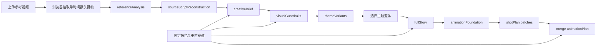

# AI 短视频导演工作流规范

## 1. 产品判断

本工作流不以“和原片越不一样越好”为目标。质量标准由两组同时成立的约束构成：

- 体验保真：同定位、同受众、同核心情绪、同类剧情驱动力、同款高价值桥段。
- 表达原创：具体人物、任务、道具、对白、场面调度和镜头表达重新设计。

抽象母题与具体表达必须分开处理。送达任务、旅途结构、情感媒介、获得帮助、被关爱对象、天气或空间推动情绪、生活化或仪式化结尾属于通用叙事构件，可以继续使用；独特台词、专有名称、罕见动作组合、独特道具组合和逐镜对应才进入禁止复制项。

## 2. 处理流程

### 阶段一：referenceAnalysis

必须回答：

- 内容定位、目标受众、故事梗概。
- 主角、配角、人物关系、主角职业或社会身份。
- 被关爱对象的身份、显性需求和隐性需求。
- 对白风格、镜头节奏、情绪曲线。
- 观众为什么愿意看完。

所有关键判断需要引用采样画面编号（F1、F2……）或用户补充文本。无法确认的内容进入 `uncertainties`，不得伪装为事实。

`referenceAnalysis.observedFacts[]` 是结构化视觉证据层。每项只保存一个直接可见 observation、受控 `factType`、`core/supporting` 重要度，以及结构化的 frame 或 video `evidenceRefs`。原生视频证据只使用整数 `startSecond/endSecond`，最大整数结束秒必须严格小于输入视频时长加 1 秒；模型不得输出毫秒字段。完整 `referenceAnalysis` 会作为下一阶段的分析上下文，但人物动机、隐性需求、叙事意义等判断不能冒充画面直接证据。分析结果由服务端签名并绑定当前 transcript、关键帧与原生视频；客户端改写或跨素材复用后必须重新分析。若原生视频请求回退为关键帧，或连续两次生成非法视频时间，系统使用同一模型和已提供关键帧重新取证；签名前只接受本次实际媒体模式对应的 evidence，不能引用模型本次没有实际收到的视频时间段。

### 阶段二：sourceScriptReconstruction

本阶段恢复为完整可读脚本还原。模型同时接收参考视频或采样画面、`referenceAnalysis`、视频元数据和用户补充字幕，按场输出：

- `timeRange`、`location`、`characters`、`visibleActions`；
- `dialogueGist`、`shotDesign`、`emotionNode`、`dramaticFunction`；
- `turningPoint`、`keyProps`、`sourceEvidence` 与 `confidence`；
- 全片 `coreEventSequence`、`relationshipPattern`、`endingAction`、`turningPoints` 和 `uncertainties`。

“完整还原”指在现有证据范围内覆盖开场、发展、转折和结尾，不等于填满采样间隙。未提供音频转写时，只能概括可确认的对白功能。`sourceEvidence` 继续使用 Reference Analysis 中已有的画面编号、时间码或用户补充文本；无法确认的身份、对白、动作和因果关系必须进入 `uncertainties`。

服务端仍会为 Analysis 和 Reconstruction 附加完整性签名，并将 Reconstruction 与当前素材上下文绑定，防止客户端篡改或跨素材误配。签名只保护通过契约校验的完整脚本，不再把脚本降级为 `sourceFacts`/`factRefs` 引用图；下游 Creative Brief、视觉规则和完整剧情会消费验签后的完整可读字段。

### 阶段三：creativeBrief

`creativeBrief` 是后续创作的唯一结构依据，必须包含：

- `storyEngine`：欲望、阻碍、升级、转折机制、回报。
- `emotionStructure`：每一阶段的剧作功能与目标情绪。
- `roleAndOccupationMapping`：原片角色功能如何映射到固定角色和赛道身份。
- `reusableHighValueBeats`：桥段价值、必须保留内容和可改变表面。
- `controlledRewriteVariables`：需要受控改写的变量。
- `protectedExpressions`：真正禁止直接复制的具体表达。
- `minimumTransformationRules`：最低变换规则及验收检查。
- `allowedNarrativeComponents`：七类通用构件的安全复用方式。
- `nonNegotiableExperience`：五项体验保真要求。

### 阶段四：visualGuardrails

`visualGuardrails` 是固定角色语义唯一生成阶段，只负责一次性确定并签发全局角色边界，不负责生成最终图片或视频负面提示词。它同时读取用户角色描述、参考分析、脚本还原和创意简报，并允许视觉模型用通用常识补全用户采用的角色原型；不使用本地物种关键词字典。用户明确肯定或否定的描述优先于模型常识，无法消解的冲突必须进入 `unresolvedConflicts` 并阻断下游。输出必须拆成：

- `fixedCharacterBoundary.requiredTraits`：后续角色参考、剧情扩写、动画规划和生成请求必须沿用的身份、外观、性格、职业或剧情功能事实；每项带 `explicit | inferred` 证据等级和模型生成的同义词。
- `fixedCharacterBoundary.allowedTraits`：允许按剧情选择使用、但不要求每个角色参考都出现的事实。
- `fixedCharacterBoundary.forbiddenTraits`：与已确定角色形象冲突、后续正向字段不得出现的事实。
- `allowedPositiveTraits` 与 `positivePromptBoundary`：由服务端从上述全局边界确定性派生，模型不得另写第二份角色事实。
- `sourceSimilarityRules`：防止主题、故事和分镜复制原片的服装、动作、道具或镜头组合。只有生成请求实际传入原片视觉参考时，相关表面元素才可能在该次请求中以 `reference_leak` 进入渲染负面词。
- `dialogueRules`：角色口癖、可用拟声词和禁用对白。台词规则不得进入图片负面提示词。

服务端将边界与当前 `creatorProfile`、`referenceAnalysis`、`sourceScriptReconstruction` 和 `creativeBrief` 的摘要绑定并签名。Variants、Legacy Full Story、Animation Plan、人物参考精修、角色图、首尾帧和视频生成只消费验签后的边界，不再解析 `fixedCharacter` 或调用模型常识重算。Character Feature Compiler 也只编译已签发 `requiredTraits(scope=appearance)`，不能重新推断固定主角。用户修改角色设定、字幕、参考视频或上游创意数据后，旧边界立即失效并要求重新生成。

该阶段没有 `commonNegativePrompt`，也不维护“未声明身体部件”的完整枚举。未声明不等于禁止；只有全局边界明确写入 `forbiddenTraits` 或存在当前镜头的有效失败证据时，相关概念才可参与后续拦截或逐镜负面词判断。

### 阶段五：themeVariants

每个主题变体必须可独立拍摄，并提供两组验收证据：

- `experienceFidelity`：逐项说明定位、受众、情绪、驱动力和高价值桥段如何保留。
- `transformationProof`：逐项说明人物、任务、细节/道具、对白和视听表达如何改变。

只替换姓名或职业不算主题变体。变体必须产生新的具体任务、环境压力、情感媒介、帮助方式和结尾仪式。

### 阶段六：fullStory

用户选择一个 `themeVariants.variants[]` 后，进入独立完整剧情页。该阶段不重新发散主题，只围绕被选中的主题变体扩写，输出：

- `characterBible`：锁定固定角色、被关爱对象、帮助者与对白规则。
- `beatSheet`：45–90 秒短视频的完整剧情节拍。
- `sceneScript`：可拍摄分场，包含地点、人物、可见动作、对白、镜头/声音、情绪节点和剧作功能。
- `keyProps`、`shootingPlan`、`retentionPlan`：进入拍摄筹备需要的道具、场景和完播设计。
- `experienceFidelity` 与 `transformationProof`：继续证明同定位、同受众、同情绪、同类驱动力、同款高价值桥段，同时重写具体表达。
- `continuityAndSafetyCheck`：确认固定角色没有被原片表面身份污染，也没有复用 protectedExpressions。

完整剧情阶段可单独切换文本模型：默认路由由现有 Qwen/MiMo 配置决定；配置 `DEEPSEEK_API_KEY` 后，页面可以显式选择 `deepseek-v4-flash` 或 `deepseek-v4-pro`。DeepSeek 不自动接管默认路由，不允许用于任何带图片或视频输入的阶段。

### 阶段七：animationPlan

完整剧情生成后，可以继续生成用于 AI 视频制作的 `animationPlan`。该阶段不直接调用具体视频模型，而是输出模型无关的首尾帧生产包：

- `productionStrategy`：默认采用 `first_last_frame_video`，单镜头控制在 3–6 秒，竖屏 9:16。
- `visualBible`：动画风格、色彩、光线、世界规则、镜头语言和角色一致性规则；不存放全局渲染负面词。
- `characterReferencePrompts`：固定角色、被关爱对象和帮助者的参考图提示词，用于先锁定视觉一致性。
- `sceneReferencePrompts`：可复用地点/场景参考提示词，用于锁定室内外属性、背景层级、光线、空间锚点和连续性规则。
- `assetPrompts`：关键道具提示词。
- `shotPlan`：逐镜头引用 `sceneId`，以 `startFrame`、`endFrame` 和 `motion` 作为 Prompt 单一事实源；服务端派生首帧、尾帧、视频和既有展示字段，并保留逐镜验收标准与 `negativePrompts.image` / `negativePrompts.video`。
- `editPlan`：剪辑节奏、转场、字幕、音乐音效、开头钩子和结尾停顿。
- `generationChecklist`：角色稳定、首尾帧因果、情绪曲线、可剪辑性和表达原创的质检标准。

动画阶段的核心原则是：先稳定视觉，再逐镜生成，不追求一次生成整条片。首尾帧用于锁定每个短镜头的完整静态起点和终点，`motion` 只描述图片无法表达的动作、时间、摄影机、光线、情绪和声音变化。

新生成的计划携带 `promptSchemaVersion: "2.0"`。逐镜结构如下：

- `startFrame` / `endFrame`：`timeAndWeather`、逐角色位置/朝向/姿态/手持物/视线/表情、前中后景、摄影机规格、物理光源、风格修饰和连续性锁；两端都必须是可独立生成的完整静态规格。
- `motion`：一个 `primaryAction`，`locked` 或 `continuous` 摄影机，起止情绪与可见表演，环境/光线变化，1–4 个连续覆盖 0–100% 的 `timingBeats`，对白/环境声/音效，以及到达尾帧后的停止条件。
- 固定摄影机要求两端核心机位一致；连续摄影机允许机位变化，但必须声明技术、路径、速度和动机。普通 shot 不允许切镜或更换地点；循环镜头必须回到兼容首帧的状态。
- `postRetime` 只记录后期变速建议，不发送给生成模型。项目配乐仍在后期统一，逐镜音频只负责对白、环境声和同步音效意图。

兼容字段 `startFramePrompt`、`endFramePrompt`、`videoPrompt`、`cameraMotion`、`characterAction`、`dialogueOrSubtitle`、`soundDesign`、`continuityNotes` 全部由共享编译器确定性生成。模型不得同时撰写第二套字符串；若导入的 v2 数据同时带结构和不一致的兼容字段，契约校验直接失败。

服务端内部将该阶段拆成三步，但 `POST /api/animation-plan` 的请求和最终响应保持不变：

1. 生成 `animationFoundation`：只生成 `visualBible`、角色/场景/资产参考和其他全局字段，不生成、占位或推测 `shotPlan`。场景参考使用服务端私有 `sourceSceneIds` 锁定剧情场次与 `sceneId` 的唯一映射；共享地点可将多个场次映射到同一场景。
2. 按 `fullStory.sceneScript` 每 2 场分批生成仅含 `{ "shotPlan": [...] }` 的结构化镜头结果。每批只能覆盖指定 `sourceSceneId`，且 shot 必须使用基础阶段锁定的对应 `sceneId`。当前批会与前面已通过的镜头一起校验；包括跨批重复负面词在内的错误，都只使用现有纠偏机制重试当前批。
3. 服务端按剧情顺序合并，统一编号 `A01...`，保留三类结构化对象，编译兼容字符串，同步重写逐镜负面词的 shot 证据路径，重算 `sceneReferencePrompts.relatedShotIds`，然后再执行一次完整 `animationPlan` 契约、正向边界和负面词相关性校验。下一批会收到上一镜完整 `endFrame` 与运动终态，而不是只收到一段尾帧散文。

分阶段结果是服务端私有结构，不写入前端状态或导出文件。合并后的公开 `animationPlan` 同时包含 v2 结构和兼容字符串；现有前端与供应商程序无需立即迁移。无 `promptSchemaVersion` 的旧计划继续按 legacy 字符串读取，不尝试从散文反推结构。

每条逐镜渲染负面词必须包含：

- `text`：最终负面描述；
- `appliesTo`：`image`、`video` 或 `both`；
- `triggerEvidence`：一个或多个 `{ sourcePath, evidence }`，指向固定角色、当前分场动作、当前 shot prompt、真实参考输入或真实供应商失败记录；
- `reasonCode`：仅允许 `explicit_identity_conflict`、`shot_object_confusion`、`shot_interaction_failure`、`temporal_consistency_failure`、`reference_leak`、`proven_provider_failure`；
- `priority`：`high`、`medium` 或 `low`；
- 可选 `enabled`：设为 `false` 时表示停用，内置单镜头生成和外部供应商程序都不应将它编译进请求。

图片和视频数组都允许为 `[]`，不设最少条目数。没有可解析证据、仅以“用户未声明/未提及”为理由、媒介不匹配、把台词规则混入画面、或在没有实际原片参考输入时使用 `reference_leak` 的候选项，会在工作流相关性裁剪中删除；保留下来的非法结构会触发现有模型纠偏重试。不同 shot 不得无差别复制同一组负面词。

剧情页必须提供两个供应商交付出口：

- JSON 导出：生产包版本为 `2.1`，保留完整剧情、选中变体、合并后的 v2 `animationPlan`、兼容字符串、模型信息和已选首尾帧图片；旧 `2.0` 包仍可导入。
- Markdown 复制：把角色参考、场景参考、资产提示词和逐镜首帧／尾帧／`videoPrompt` 整理成可直接粘贴到供应商程序的生产包。

页面内保留单镜头试片链路。`POST /api/generate-shot-video` 的 `generationMode` 是模式权威字段，不从 provider、模型名或素材数量推断：

- `first_last_frame`：首帧和尾帧是精确端点，仍执行现有尾帧硬依赖校验；Kling、Seedance 与 MiniMax H3 均可使用。
- `all_reference`：`referenceAssets[]` 是参考素材权威来源，允许图片、视频、音频；首尾帧和角色图只有在用户显式勾选后才作为普通 `reference_image` 加入。该模式不生成或校验精确端点，不得混入 `first_frame` / `last_frame`。当前仅 Seedance 2.0 与 MiniMax H3 有已验证的 R2V API 协议；可灵当前 image-to-video 接入必须明确失败，不能静默降级。

全能参考共同限制为图片最多 9 张、视频最多 3 段、音频最多 3 段，单段视频或音频 2–15 秒，视频与音频各自总时长不超过 15 秒，不能只输入音频，请求体不超过 64MB。服务端按实际 data URL MIME、文件字节和 ffprobe 时长再次验证用户媒体，而不是重新判断 AI 输出。两种模式均支持异步轮询、下载 mp4、1–4 个候选结果，以及回执中的 `negativePromptDelivery` 和脱敏 `requestPreview`。

仓库不提供 JSONL 任务队列、production workspace、批量执行器、本地质检、失败队列重试或 ffmpeg 成片合成。整片批量生成时，外部供应商程序负责把 `shotPlan[]` 中的首尾帧、`videoPrompt`、`negativePrompts.video` 和验收标准映射到它自身的请求协议。

## 3. 模型与媒体策略

- 浏览器从本地视频均匀采样 6–10 张关键帧，最长边压缩到 720px；在 MiMo `auto/video` 模式且文件大小允许时，同时用 base64 `video_url` 发送原生视频。应用不持久化视频。
- `auto` 模式下，推理服务不接受原生视频时自动回退关键帧；超出大小限制时直接走关键帧。
- MiMo 多模态视觉输入必须在文本指令之前；用户消息末尾保留 `/no_think`，请求体同时设置 `thinking={"type":"disabled"}`。
- 默认阶段路由保持 Qwen 优先、MiMo 回退。DeepSeek 只在页面按阶段显式选择后参与创意简报、主题变体、Legacy Full Story、Animation Plan 或 Static Frame Compiler；默认模型为 `deepseek-v4-flash`，`deepseek-v4-pro` 为显式可选项，不静默回退。
- DeepSeek 请求只发送字符串文本，使用官方 OpenAI 兼容 `/chat/completions`、`max_tokens`、`thinking` 和 JSON Output。参考片分析、脚本还原、视觉规则、人物图修正属于媒体输入阶段，前端不提供 DeepSeek，服务端也会在 provider 调用前拒绝绕过请求。
- 当前实现通过小米 OpenAI 兼容 `/chat/completions` 接口连接 MiMo V2.5；原生视频使用 `video_url`，并携带 `fps=2`、`media_resolution=default`。Qwen 通过阿里云 Model Studio OpenAI 兼容 `/chat/completions` 接收文本、图片或视频。未配置服务时使用明确标注的演示模式。

## 4. 当前边界

- 项目固定使用 Node.js 24 LTS（见 `.nvmrc`，`package.json` 限定 `>=24 <25`）；验收测试应在该版本执行，避免把非支持版本或受限沙箱禁止监听本地回环端口造成的 native assertion 误判为业务失败。
- 原生视频过大或推理服务不支持 `video_url` 时会回退浏览器抽帧；快速剪辑、声音设计和未出现在采样帧中的动作可能遗漏。
- 音频尚未自动转写。需要准确对白时，应粘贴字幕/转写，或后续增加 ASR 阶段。
- 模型输出经过 JSON 解析、嵌套契约校验和一次纠偏重试；当前仍未采用外部 JSON Schema 引擎。
