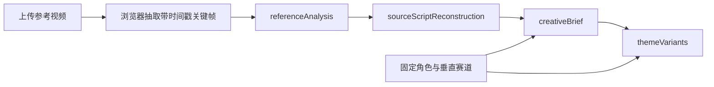

# AI 短视频导演工作流规范

## 1. 产品判断

本工作流不以“和原片越不一样越好”为目标。质量标准由两组同时成立的约束构成：

- 体验保真：同定位、同受众、同核心情绪、同类剧情驱动力、同款高价值桥段。
- 表达原创：具体人物、任务、道具、对白、场面调度和镜头表达重新设计。

抽象母题与具体表达必须分开处理。送达任务、旅途结构、情感媒介、获得帮助、被关爱对象、天气或空间推动情绪、生活化或仪式化结尾属于通用叙事构件，可以继续使用；独特台词、专有名称、罕见动作组合、独特道具组合和逐镜对应才进入禁止复制项。

## 2. 处理流程

### 阶段一：referenceAnalysis

必须回答：

- 内容定位、目标受众、故事梗概。
- 主角、配角、人物关系、主角职业或社会身份。
- 被关爱对象的身份、显性需求和隐性需求。
- 对白风格、镜头节奏、情绪曲线。
- 观众为什么愿意看完。

所有关键判断需要引用采样画面编号（F1、F2……）或用户补充文本。无法确认的内容进入 `uncertainties`，不得伪装为事实。

### 阶段二：sourceScriptReconstruction

按场输出时间、地点、人物、可见动作、对白大意、景别与镜头、情绪节点、剧作功能、转折点、关键道具和证据置信度；另行输出核心事件顺序、关系模式和结尾动作。

“完整还原”指在现有证据范围内覆盖开场、发展、转折和结尾，不等于填满采样间隙。未提供音频转写时，只能概括可确认的对白功能。

### 阶段三：creativeBrief

`creativeBrief` 是后续创作的唯一结构依据，必须包含：

- `storyEngine`：欲望、阻碍、升级、转折机制、回报。
- `emotionStructure`：每一阶段的剧作功能与目标情绪。
- `roleAndOccupationMapping`：原片角色功能如何映射到固定角色和赛道身份。
- `reusableHighValueBeats`：桥段价值、必须保留内容和可改变表面。
- `controlledRewriteVariables`：需要受控改写的变量。
- `protectedExpressions`：真正禁止直接复制的具体表达。
- `minimumTransformationRules`：最低变换规则及验收检查。
- `allowedNarrativeComponents`：七类通用构件的安全复用方式。
- `nonNegotiableExperience`：五项体验保真要求。

### 阶段四：themeVariants

每个主题变体必须可独立拍摄，并提供两组验收证据：

- `experienceFidelity`：逐项说明定位、受众、情绪、驱动力和高价值桥段如何保留。
- `transformationProof`：逐项说明人物、任务、细节/道具、对白和视听表达如何改变。

只替换姓名或职业不算主题变体。变体必须产生新的具体任务、环境压力、情感媒介、帮助方式和结尾仪式。

## 3. 模型与媒体策略

- 浏览器从本地视频均匀采样 6–10 张关键帧，最长边压缩到 720px；在 MiMo `auto/video` 模式且文件大小允许时，同时用 base64 `video_url` 发送原生视频。应用不持久化视频。
- `auto` 模式下，推理服务不接受原生视频时自动回退关键帧；超出大小限制时直接走关键帧。
- MiMo-VL 视觉输入必须在文本指令之前，`/no_think` 位于用户消息末尾。
- 推荐使用 `XiaomiMiMo/MiMo-VL-7B-RL-2508`，推理参数 `temperature=0.3`、`top_p=0.95`。
- 当前实现通过 OpenAI 兼容 `/chat/completions` 接口连接自托管 MiMo-VL；原生视频使用 `video_url`，视觉内容位于文本之前。未配置服务时使用明确标注的演示模式。

## 4. 当前边界

- 原生视频过大或推理服务不支持 `video_url` 时会回退浏览器抽帧；快速剪辑、声音设计和未出现在采样帧中的动作可能遗漏。
- 音频尚未自动转写。需要准确对白时，应粘贴字幕/转写，或后续增加 ASR 阶段。
- 模型输出经过 JSON 解析和输入约束，但还没有完整 JSON Schema 自动修复循环。
